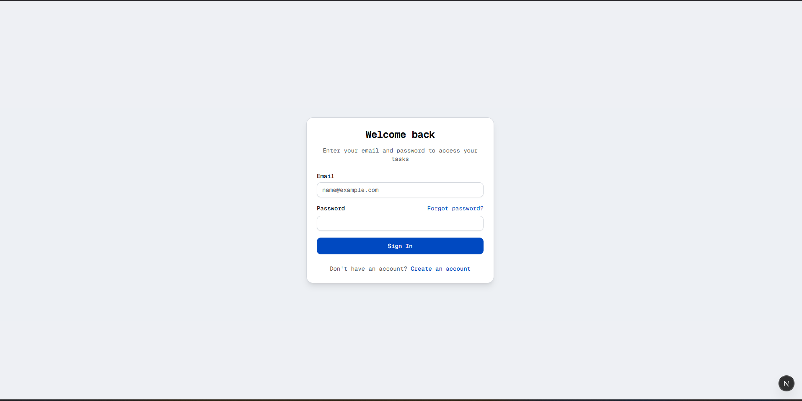
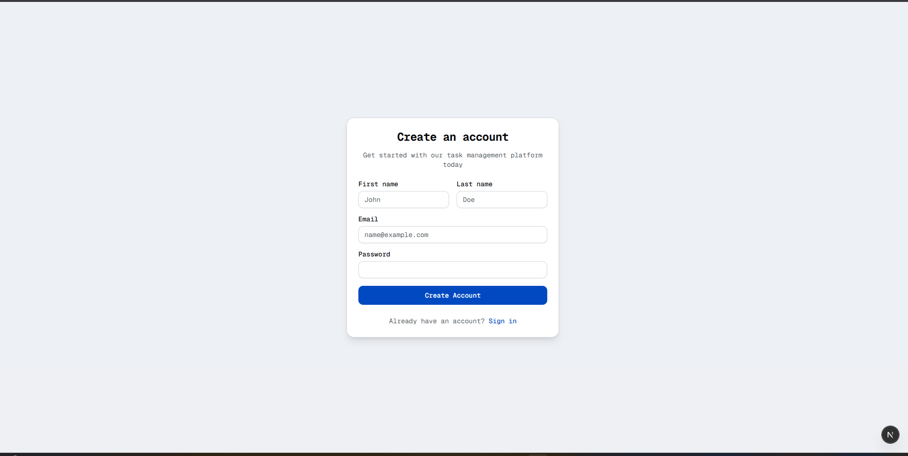
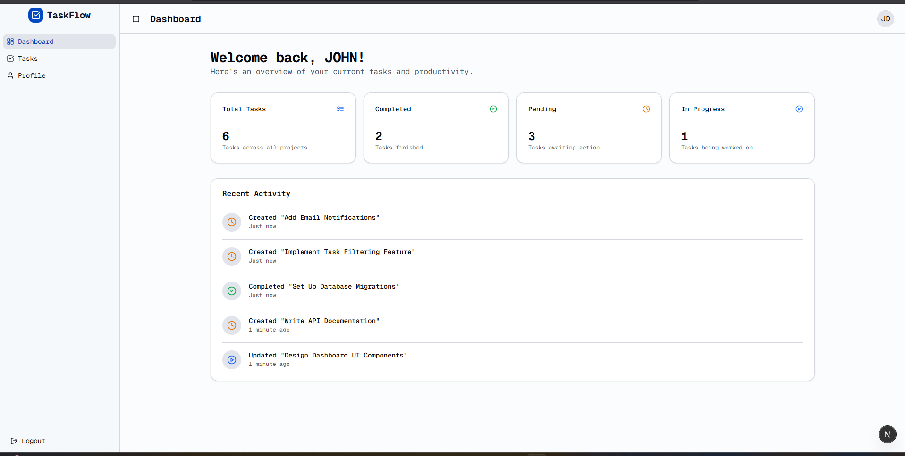
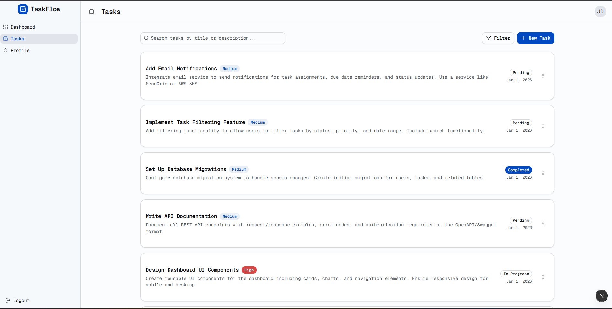
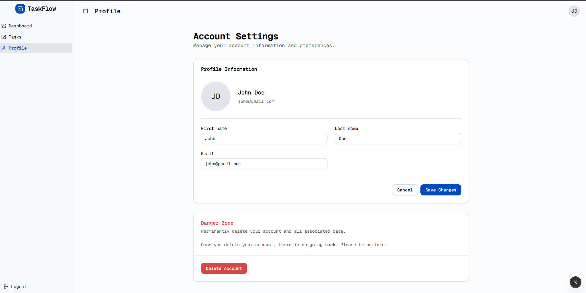

# PrimeTrade - Task Management System

A full-stack task management application built with Next.js and Express.js, featuring user authentication, task CRUD operations, and a modern UI.

## 📸 Screenshots


*Dashboard Overview*


*Task Management Interface*


*Create Task Modal*


*User Profile Management*


*Authentication Page*

## ✨ Features

- **User Authentication**: Sign up, login, logout with JWT-based session management
- **Task Management**: Create, read, update, and delete tasks
- **Task Filtering**: Filter by status (Pending, In Progress, Completed) and priority (Low, Medium, High)
- **Search Functionality**: Real-time search across task titles and descriptions
- **Dashboard Analytics**: View task statistics and recent activity
- **Profile Management**: Update user profile information
- **Responsive Design**: Works seamlessly on desktop and mobile devices

## 🛠️ Tech Stack

### Frontend
- **Next.js 16** - React framework
- **TypeScript** - Type safety
- **Zustand** - State management
- **Tailwind CSS** - Styling
- **Shadcn UI** - Component library
- **Axios** - HTTP client
- **React Hot Toast** - Notifications

### Backend
- **Express.js** - Web framework
- **MongoDB** - Database
- **Mongoose** - ODM
- **JWT** - Authentication
- **bcryptjs** - Password hashing
- **Cookie Parser** - Cookie management

## 🚀 Setup Instructions

### Prerequisites
- Node.js (v18 or higher)
- MongoDB (local or Atlas)
- npm or yarn

### Backend Setup

1. Navigate to backend directory:
```bash
cd backend
```

2. Install dependencies:
```bash
npm install
```

3. Create `.env` file in backend directory:
```env
MONGODB_URI=your_mongodb_connection_string
JWT_SECRET=your_jwt_secret_key
PORT=5000
```

4. Start the server:
```bash
npm run dev
```

Backend will run on `http://localhost:5000`

### Frontend Setup

1. Navigate to frontend directory:
```bash
cd frontend
```

2. Install dependencies:
```bash
npm install
```

3. Start the development server:
```bash
npm run dev
```

Frontend will run on `http://localhost:3000`

## 📝 Environment Variables

### Backend (.env)
```
MONGODB_URI=mongodb://localhost:27017/primetrade
JWT_SECRET=your_secret_key_here
PORT=5000
```

## 🎯 Usage

1. **Sign Up**: Create a new account
2. **Login**: Access your dashboard
3. **Create Tasks**: Click "New Task" to add tasks
4. **Manage Tasks**: Edit, delete, or update task status
5. **Filter & Search**: Use filters and search to find tasks
6. **View Dashboard**: Check statistics and recent activity

## 📁 Project Structure

```
primetrade_frontend/
├── backend/
│   ├── config/         # Database configuration
│   ├── controllers/    # Route controllers
│   ├── middlewares/    # Auth middleware
│   ├── models/         # MongoDB models
│   ├── routes/         # API routes
│   └── server.js       # Entry point
└── frontend/
    ├── app/            # Next.js pages
    ├── components/     # React components
    ├── store/          # Zustand stores
    ├── lib/            # Utilities
    └── public/         # Static assets
```

## 🔐 API Endpoints

- `POST /api/user/signup` - User registration
- `POST /api/user/login` - User login
- `GET /api/user/profile` - Get user profile
- `PUT /api/user/:id` - Update user profile
- `DELETE /api/user/:id` - Delete user account
- `GET /api/task` - Get all tasks
- `POST /api/task` - Create task
- `PUT /api/task/:id` - Update task
- `DELETE /api/task/:id` - Delete task

# How To Scale
For production scaling:
- Separate frontend & backend deployments
- Use Redis for caching
- Rate limiting & refresh tokens
- Docker + CI/CD
- Role-based access control


Built with ❤️ using Next.js and Express.js

